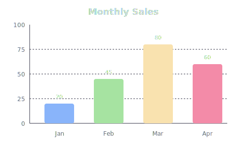

# PlainViz

PlainViz is a **plain-text-first data visualization language and toolkit**.

It lets you describe charts as readable text — and render them programmatically.

**Current focus:** bar charts
**Status:** early stage (APIs and syntax may change)

---

## 15-Second Example

```plainviz
Type: Bar
Title: Monthly Sales

Jan: 20
Feb: 45
Mar: 80
Apr: 60
```

**Renders to:**



---

## Installation

```bash
# Core packages
npm install @plainviz/core @plainviz/render-svg

# For Markdown/Remark integration
npm install remark-plainviz
```

---

## Usage

### JavaScript / TypeScript

```ts
import { parse } from '@plainviz/core';
import { render } from '@plainviz/render-svg';

const input = `
Type: Bar
Title: Sales

Q1: 100
Q2: 200
Q3: 150
`;

const result = parse(input);

if (result.ok) {
  const svg = render(result.ir);
  console.log(svg); // SVG string
}
```

### CLI

```bash
# Clone the repo, then:
node --import tsx scripts/render-svg.mjs examples/01-basic.pv > chart.svg
```

### Markdown (Remark Plugin)

```js
import { remark } from 'remark';
import remarkHtml from 'remark-html';
import remarkPlainViz from 'remark-plainviz';

const markdown = `
# Report

\`\`\`plainviz
Type: Bar
Title: Q1 Results

Product A: 500
Product B: 750
\`\`\`
`;

const result = await remark()
  .use(remarkPlainViz)
  .use(remarkHtml)
  .process(markdown);

// plainviz code blocks are replaced with SVG charts
```

---

## Syntax

```plainviz
Type: Bar              # Chart type (bar, line, pie, area)
Title: "Chart Title"   # Optional title
Subtitle: "Subtitle"   # Optional subtitle

# Data (label: value)
Product A: 500
Product B: $1,200      # $ and commas are auto-cleaned
Product C: 45%         # % is auto-cleaned
```

---

## Packages

| Package | Description |
|---------|-------------|
| [`@plainviz/core`](https://www.npmjs.com/package/@plainviz/core) | Parser and IR types |
| [`@plainviz/render-svg`](https://www.npmjs.com/package/@plainviz/render-svg) | SVG renderer |
| [`remark-plainviz`](https://www.npmjs.com/package/remark-plainviz) | Remark plugin for Markdown |

---

## Project Structure

```
plainviz/
├── packages/
│   ├── core/           # @plainviz/core
│   ├── render-svg/     # @plainviz/render-svg
│   └── remark-plainviz/
├── apps/
│   └── playground/     # Web playground (Vite + React)
├── examples/           # .pv example files
└── scripts/            # CLI tools
```

---

## Why Plain Text?

* Works naturally with **Git and diff**
* Easy to **read, write, and review**
* Survives copy/paste, chat tools, and documentation
* Makes **visual intent explicit**, not hidden in UI state

---

## Links

* npm: [@plainviz/core](https://www.npmjs.com/package/@plainviz/core)
* GitHub: [github.com/PlainViz/plainviz](https://github.com/PlainViz/plainviz)
* Website: [plainviz.com](https://plainviz.com)

---

## Contributing

* Issues and conceptual discussions are welcome
* Feedback on syntax and mental models is especially useful

---

## License

MIT
